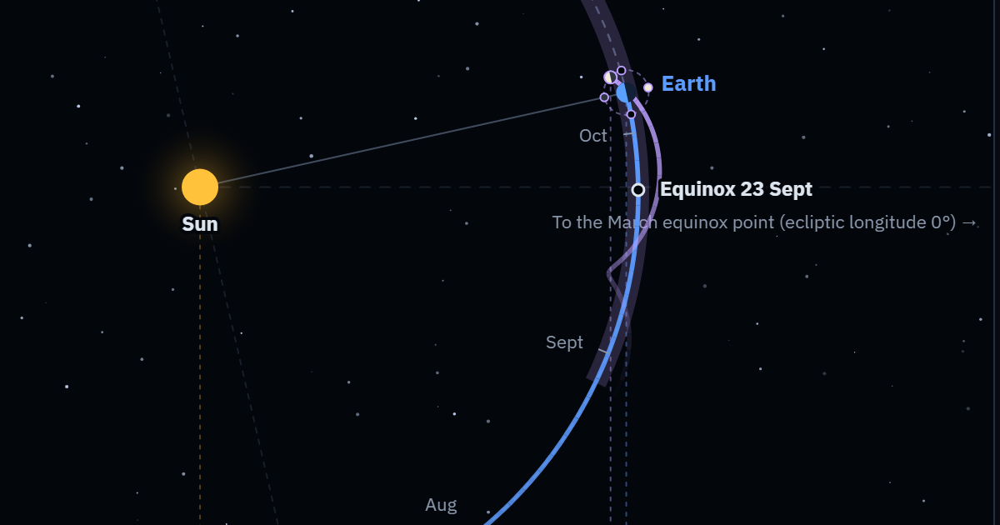

# Earth and Moon Orbits

English | [日本語](README.ja.md)



An interactive astronomy teaching page. The Moon seems to circle the Earth, but seen from far above the Sun it travels in a gentle wave across Earth's orbit, and never loops back.

**[Open the page](https://ok1971.github.io/earth_moon_orbits/)** in any modern browser; there is nothing to install.

- Top view of the Earth and Moon going around the Sun, with the Moon's trail weaving across Earth's orbit
- Edge-on view showing the tilt of the Moon's orbit and the eclipse seasons
- Straightened-orbit view that shows why the Moon's path waves but does not loop
- The Moon's phase and place in the sky from 15 cities, or from any latitude and longitude
- 12 languages; the page follows the browser's language, and `#ja`, `#en` and so on at the end of the address choose one
- A single HTML file: download `earth-moon-orbits.html` and it also works offline (with the computer's own fonts)

Positions are computed from JPL mean orbital elements and the main terms of Meeus's lunar theory. Released under the [MIT License](LICENSE).

The sections below explain how the page is built and how to add a language. A new language needs one language file and no changes to the program.

## Folder layout

```
src/
  app.html          the page itself (HTML, CSS and JavaScript), without any translated text
  locales/
    ja.json         the base language (the source text), which also holds the notes for translators
    en.json, ...    one file per language
tools/
  build.py              assembles earth-moon-orbits.html and index.html from src
  check_translations.py checks the translations (mechanical checks, and a review of the content by Claude)
  snapshot.py           screenshots every language, to compare the page before and after a change
images/
  preview.png           the preview image shown when a link to the page is shared (1200 × 630)
earth-moon-orbits.html  the assembled page; this is the file to publish
index.html              the entry page of the GitHub Pages site; forwards to earth-moon-orbits.html (keeping #ja and the like)
```

Do not edit `earth-moon-orbits.html` or `index.html` directly: every build overwrites them.

Search results, and the previews shown when a link is shared on social media or in a message, use the title (`title`), the description (`shareDescription`) and the preview image. Previews are read without running the page's script, so they are in the fallback language (English). The address the site is published at is `SITE_URL` in `tools/build.py`.

## Everyday workflow

Run the commands in the project folder (the examples are for Windows).

1. Edit `src/app.html` or `src/locales/*.json`
2. Build: `.venv\Scripts\python tools\build.py`
3. Check the translations mechanically: `.venv\Scripts\python tools\check_translations.py --dry-run`
4. Check the rendering (when needed): see [Comparing screenshots](#comparing-screenshots) below

When you change the Japanese (source) text, update the other languages as well, and use the check in step 3 to make sure nothing is missing.

## Writing a language file

A language file has four parts. For example, from `ja.json`:

```json
{
  "meta":       { … settings for the language … },
  "strings":    { "title": "地球と月の公転軌道", … },
  "places":     { "tokyo": "東京", … },
  "solarTerms": [ "春分", "清明", … ]
}
```

### meta (settings for the language)

| Field | Meaning | Example |
|---|---|---|
| `name` | The language's name in the language itself, shown in the language menu (required) | `"日本語"` |
| `locale` | The locale used to format numbers and dates (required) | `"ja-JP"`, `"ar-u-nu-latn"` |
| `order` | Position in the language menu. Languages without one come last | `2` |
| `dir` | Writing direction. Only right-to-left languages need it, as `"rtl"` | `"rtl"` |
| `googleFonts` | Extra Google Fonts to load. Not needed for the Latin or Cyrillic alphabets | `"BIZ+UDPGothic:wght@400;700"` |
| `fontUI`, `fontTitle` | Typefaces for the text and for the title (a CSS font-family) | `"\"BIZ UDPGothic\", Meiryo, sans-serif"` |
| `titleLetterSpacing` | Letter spacing of the title | `".06em"` |
| `joinedScript` | `true` for scripts whose letters join, such as Arabic. Letters are then never spaced out | `true` |
| `largeNumbers` | How to write large distances: `myriad` uses units of 10⁴ and 10⁸ (万 and 億), `indian` uses lakh and crore. Without it, distances are in millions (`strings.kmMillion`) | `{"style": "myriad", "units": ["億", "万"], "separator": ""}` |
| `shortDate` | Short dates inside the diagrams. `"month/day"` gives the form 5/6. Without it, the language's standard short form is used | `"month/day"` |

### strings (the translations)

- The keys are the same as in the base file `ja.json`; the values are the translations.
- Placeholders in braces, such as `{n}` and `{place}`, are filled in with numbers or place names when the page runs. Keep them as they are; you may move them to suit the word order.
- In languages where a word changes form with the number (`{n}`), write one text for each form instead of a single text.

  ```json
  "daysUnit": { "one": "day", "other": "days" }
  ```

  The forms are `zero`, `one`, `two`, `few`, `many` and `other`, and `other` is required. Which numbers take which form is fixed for each language (by the Unicode CLDR rules), and the browser chooses the form.
- Values that are lists (the names of the Moon's phases, the compass directions and so on) must have the same number of items, in the same order, as in Japanese.

### places and solarTerms

- `places` holds the names of the observing sites. Keep the keys (`tokyo` and so on) and translate only the names.
- `solarTerms` holds the names of the 24 solar terms (二十四節気), starting from the vernal equinox. Write it only for languages that use the solar terms; the page then shows them automatically.

### Notes for translators (notes, ja.json only)

In `ja.json`, `notes` holds what translators should know about each key. The notes are written in Japanese, like the source text, and are not included in the page.

```json
"notes": {
  "vernalDir": { "note": "上の図の右端に右寄せで描く矢印の文字。…", "maxWidth": 56 }
}
```

- `note`: where the text appears, and what to watch for when translating it. It is also given to Claude for the content review.
- `maxWidth`: the maximum display width, counted in half-width characters (a full-width character counts as 2, a combining character as 0). Use it for text that would overflow if it were too long, such as text inside the diagrams. The check reports text that exceeds it.
- `onlyWithSolarTerms`: `true` for text shown only in languages that use the solar terms.
- `fallbackOnly`: `true` for text of which only the fallback language's (English) version is used, such as the description in link previews. Other languages need not include it.

## Adding a language

German (`de`) as an example:

1. Copy `src/locales/en.json` to `src/locales/de.json`
2. Change `meta`: `"name": "Deutsch"`, `"locale": "de-DE"`, `"order": 13`. Remove any settings left over that were meant for English
3. Translate `strings` and `places` (see also the `notes` in `ja.json`)
4. Check it mechanically: `.venv\Scripts\python tools\check_translations.py --dry-run de`
   - This reports missing keys, placeholders such as `{n}` that do not match, and text that is too wide
5. Optionally, have the content reviewed: `.venv\Scripts\python tools\check_translations.py de`
   - This step is optional. The language can be built and published without it; skip it, for example, when a fluent speaker has already checked the translation
   - Claude compares the translation with the Japanese source and writes the results to `translation-report.md`
   - It needs `ANTHROPIC_API_KEY` in `.env`, and costs about US$0.20 per language
6. Build: `.venv\Scripts\python tools\build.py`
7. Check the rendering: run `.venv\Scripts\python tools\snapshot.py take shots --langs de` and open `shots\de.png`

No changes to the program are needed. When the browser's language setting matches, the page opens in that language the first time it is opened.

## Comparing screenshots

You can screenshot every language before and after a change and compare them (Microsoft Edge is required).

```
.venv\Scripts\python tools\snapshot.py take before    # before the change
(make the change and run build.py)
.venv\Scripts\python tools\snapshot.py take after     # after the change
.venv\Scripts\python tools\snapshot.py compare before after
```

- The screenshots show the page paused at 11:00 UTC on 6 May 2027, in Tokyo.
- So that every screenshot comes out the same, web fonts are not loaded; the page uses the computer's own fonts.
- A difference of only one row (one pixel) can be rendering noise at the edge of a diagram's frame. Take the screenshots again to make sure.

## Setup (first time only)

```
python -m venv .venv
.venv\Scripts\python -m pip install anthropic
```

`build.py` and `snapshot.py` need only Python's standard library. `check_translations.py` needs the `anthropic` package, even with `--dry-run`.
The results of the translation review (`translation-report.md`) are a working record, so git does not track them.

## License

MIT License ([LICENSE](LICENSE)). Copyright (c) 2026 ok1971

You may use, modify and redistribute the teaching page freely, including commercially. When you redistribute it, keep the copyright notice and the license text.
The built `earth-moon-orbits.html` carries the same text at its top, so distributing the HTML file on its own already meets these conditions.

## Sources

- Earth's orbit: the mean orbital elements of the Earth–Moon barycentre (EM Bary) in NASA/JPL (E. M. Standish), "Keplerian Elements for Approximate Positions of the Major Planets" — https://ssd.jpl.nasa.gov/planets/approx_pos.html
- The Moon's position: the main terms of Tables 47.A and 47.B in chapter 47 of Jean Meeus, *Astronomical Algorithms* (2nd edition, 1998), whose coefficients come from the lunar theory ELP-2000/82 of Chapront and others
- Typefaces: IBM Plex, Noto Sans and Noto Serif, BIZ UDPGothic, Shippori Mincho B1 and others, all under the SIL Open Font License 1.1 and loaded from Google Fonts (they are not included in this repository)
- Translation review: `tools/check_translations.py` uses Anthropic's Claude API (the Python package `anthropic`). The teaching page itself does not use the Claude API
